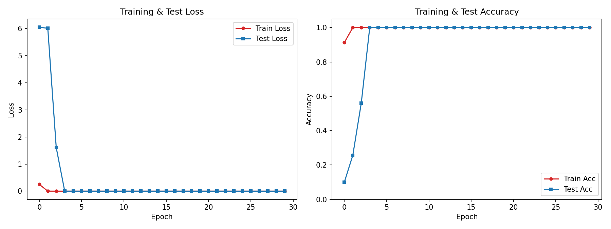

# Synchronous Motor Electrical Fault Diagnosis with CNN

A convolutional neural network pipeline for classifying five electrical fault types
(plus normal operation) in an inverter-driven synchronous motor, using stator
voltage/current, rotor current, and speed signals. Built as a course project for
*Electrical Machines 2* and later hardened into a reproducible, validated pipeline.

## Table of contents
- [Problem](#problem)
- [Dataset](#dataset)
- [Approach](#approach)
- [Results](#results)
- [Validation: why you can trust the 100%](#validation-why-you-can-trust-the-100)
- [Repository structure](#repository-structure)
- [Setup](#setup)
- [Usage](#usage)
- [Authors](#authors)
- [License](#license)

## Problem

Synchronous motors are widely used in industrial drives, wind turbines, electric
vehicles, and marine/rail propulsion. Long-term operation leads to electrical,
mechanical, and magnetic faults. This project targets **electrical** faults
specifically, using a public experimental dataset built for benchmarking fault
diagnosis algorithms on an inverter-driven synchronous motor. The dataset covers
six classes:

| Label | Fault |
|---|---|
| 0 | Rotor excitation voltage cutoff (`Rotor_Current_Faild`) |
| 1 | Phase disconnected between inverter and motor (`Disconnect_Phase`) |
| 2 | Rotor excitation current changed via rheostat (`Rotor_Current_Failed_R`) |
| 3 | Short circuit between two phases |
| 4 | Phase-to-neutral short circuit |
| 5 | Normal operation (no fault) |

Each recording captures three phase voltages, three phase currents, rotor current,
and rotor speed, sampled around the moment the fault is introduced.

## Dataset

The raw `.mat` files and the packaged `data_all.npy` are **not included** in this
repository (several hundred MB, and not this repo's data to redistribute). To
reproduce:

1. Obtain the six `Preprocessed_*.mat` files (per-class `train_data` /
   `label_data` arrays).
2. Run the notebook/steps that pack them into a single `data_all.npy` — a dict
   keyed by `(class_index, 0)` → signal array `[n_samples, 10000, 9]` and
   `(class_index, 1)` → label array `[n_samples, 1]`.
3. Place `data_all.npy` next to the scripts in `src/`.

`tools/check_labels.py` will verify the raw `.mat` files are labeled correctly
before you do anything else — see [Usage](#usage).

## Approach

Two independent implementations were built and compared:

- **`src/baseline_cnn.py`** — TensorFlow/Keras reference CNN matching the
  original paper-style architecture: a single Conv2D(32, 3×3) + BatchNorm + ReLU +
  MaxPool block, followed by four Dense(256, ReLU) layers and a softmax output.
  Trained with Adam, 8 epochs, batch size 16. This is the *reference classifier*
  the dataset was designed around.
- **`src/motor_fault_cnn.py`** + **`src/pfdataset.py`** — a custom PyTorch
  pipeline. Each windowed signal (e.g. 600 samples around the fault onset) is
  L2-normalized and reshaped into a pseudo-image `[n_features, 30, 20]`, then fed
  through four stacked Conv2d+BatchNorm+ReLU blocks (no pooling) and two fully
  connected layers.

The PyTorch version is the actively maintained/validated one in this repo.

## Results

Rotor current + speed as input features, 600-sample window (300 before / 300
after fault onset), Adam optimizer:



```
              precision    recall  f1-score   support

           0     1.0000    1.0000    1.0000        59
           1     1.0000    1.0000    1.0000       140
           2     1.0000    1.0000    1.0000       112
           3     1.0000    1.0000    1.0000       146
           4     1.0000    1.0000    1.0000       153
           5     1.0000    1.0000    1.0000        68

    accuracy                         1.0000       678
```

Full report: [`results/classification_report.txt`](results/classification_report.txt).

Note: rotor current + speed is *not* one of the two feature combinations the
original reference paper reports reaching 100% on (stator voltage + rotor
current, or stator current + rotor current) — so this is an additional,
independently-confirmed result rather than a reproduction of a reported number.

## Validation: why you can trust the 100%

A test accuracy of 100% is exactly the kind of number that deserves suspicion
before it deserves a screenshot. Before trusting it, this pipeline was checked
against the failure modes that most commonly produce fake-looking perfect
results:

- **Code-level train/test leakage** — checked directly that `random_split`
  produces disjoint index sets (zero overlap), and additionally ran the full
  pipeline on a synthetic dataset with a deliberately-imposed ~85% accuracy
  ceiling (15% of samples per class carry another class's signal but keep their
  true label). The pipeline correctly plateaued at ~82–84% and never exceeded the
  ceiling — ruling out leakage in the `Dataset`/`DataLoader`/split logic.
- **Recording-session confound** — re-trained with a *chronological* split
  (first 80% of each class's samples as train, last 20% as test, instead of a
  random shuffle) to check whether the model was exploiting session-level
  artifacts (temperature drift, equipment calibration, etc.) rather than the
  actual fault signature. Accuracy held at 100% under this stricter split too.
- **Label integrity** — verified each raw `.mat` file carries a single, constant
  label value, and that the six files together cover `{0,1,2,3,4,5}` exactly
  once (`tools/check_labels.py`).
- **Per-class breakdown, not just aggregate accuracy** — precision *and* recall
  are 1.0000 for every one of the 6 classes individually (not just a couple of
  "easy" ones dragging up an average).
- **Visual sanity check** — plotted raw samples per class (`tools/plot_samples.py`)
  to confirm the learned distinctions correspond to visible differences in the
  signal, not an artifact. This also surfaced a real discrepancy worth
  documenting: classes 2 and 4 show a *continuous* oscillation across the whole
  window rather than the single-onset step change the original experimental
  description implies — worth flagging if you build on this dataset further.

Also fixed along the way (see `src/pfdataset.py` and `src/motor_fault_cnn.py`
comments for details): a filename/import mismatch that prevented the script from
running at all, a hardcoded flatten dimension that broke for any window length
or feature count other than the one originally used, an SGD optimizer with an
Adam-tuned learning rate and no momentum (empirically confirmed to stall — train
loss barely moved over 40 epochs, vs. reaching ~0 within ~20 for Adam on the same
architecture), a scheduler stepped every batch instead of every epoch, an
in-place tensor mutation that corrupted the underlying dataset array, and a
hardcoded Windows output path.


## Usage

```bash
# 1) sanity-check the raw .mat files (run once, from the folder containing them)
python tools/check_labels.py

# 2) (optional) visually inspect a few real samples per class
python tools/plot_samples.py

# 3) train
cd src
python motor_fault_cnn.py

# 4) (optional) stress-test against session/recording-order leakage
python ../tools/sequential_split_test.py
```

`motor_fault_cnn.py` stops automatically once test accuracy has held ≥99.9% for
8 consecutive epochs, instead of always running the full epoch budget.

Course: *Electrical Machines 2 & Electrical Machines Lab 1*, Instructor: Dr.
Aghashabani. 

## License

No license has been chosen yet
